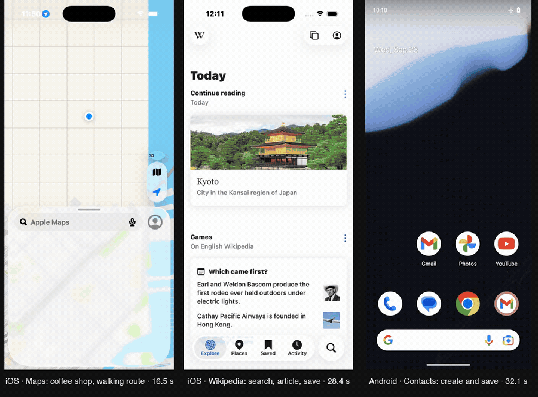

# jev-phone

[](https://github.com/Rajmeet/jev-phone/actions/workflows/ci.yml) [](LICENSE) [](https://bun.sh) [](#quickstart)

Drive a phone with a model that never writes a word.

Search Maps for a coffee shop and get walking directions. Find an article in Wikipedia and save it for later. Open Contacts, create a contact, save it. Turn on Airplane mode. Each step is one call to [Jev](https://docs.typesafe.ai/concepts/system-one), TypeSafe's System One model, which looks at the screen's elements and picks what to tap. A small LLM types when something needs typing. [phone-use](https://www.npmjs.com/package/@phone-use/sdk) runs it on an iOS Simulator, an Android device, or a cloud phone.



*Three goals, recorded speed, side by side. Left: Apple Maps, find Blue Bottle Coffee and get walking directions, 16.5 s. Middle: Wikipedia, search Lisbon, open the article, save it, 28.4 s. Right: Android Contacts, create and save a contact, 32.1 s. Each was checked afterwards by reading the phone: the route in the tree, the article in the Saved tab, the row in the contacts database.*

Jev is in early access, but the [Vercel AI Gateway](https://vercel.com/ai-gateway) serves it today. One gateway key runs everything here.

## Quickstart

You need [Bun](https://bun.sh), a phone, and a gateway key.

```bash
git clone https://github.com/Rajmeet/jev-phone.git
cd jev-phone
bun install
cp .env.example .env     # AI_GATEWAY_API_KEY=...
```

**iOS Simulator** (macOS, Xcode, a booted simulator):

```bash
bun examples/run.ts "Open Settings and go to General, then About"
```

**Android** (any emulator or device `adb` can see):

```bash
bun examples/run.ts --device android "In Settings, turn on Airplane mode"
```

**Cloud phone**, iOS or Android, no Mac needed:

```bash
npm i -g phone-use && phone-use login
phone-use create ios            # or: phone-use create android
eval "$(phone-use env <id>)"
bun examples/run.ts --device cloud "Create a contact named Ada Lovelace and save it"
```

You get one line per decision:

```text
phone: iPhone 17 Pro
 1.   2.5s  TYPE "Apple Maps" ← "Blue Bottle Coffee"   conf 0.95   527ms  → screen changed
 2.   8.9s  TAP "Blue Bottle Coffee, 200 ft · 1 Ferry Building"  conf 0.97   999ms  → screen changed
 3.  12.6s  TAP "Directions"                            conf 0.83  1027ms  → stale, decided again
 4.  13.9s  TAP "2 min, walking"                        conf 0.87   467ms  → screen changed
 5.  16.5s  DONE                                        done 0.76   268ms
```

Add `--debug` to see every probability Jev returned, `--screenshots <dir>` to save a frame per step.

Four scripts run a fixed goal and then check the phone themselves: `examples/directions.ts` (the demo above; give the simulator a location first with `xcrun simctl location <udid> set 37.7955,-122.3937`), `examples/wiki-save.ts`, `examples/bold-text.ts` and `examples/new-contact.ts`.

## How it works

Every step reads the accessibility tree once and turns it into a numbered menu:

```text
controls      [1] Cell   General          [2] Cell  Accessibility   [3] Button  Search
switches      [1] Switch Bold Text  value 0
text_fields   [1] SearchField  Search
apps          Contacts, Calendar, Maps, ...
```

That menu goes to Jev in one request with several questions: which operation (`TAP`, `TOGGLE`, `TYPE`, `SCROLL`, `BACK`, `OPEN_APP`, `WAIT`, `DONE`, `BLOCKED`), which target *if* it's a tap, which *if* it's a toggle, which *if* it's a type, and, separately, whether the goal already looks done. Only operations the screen supports are offered, and each target list only holds elements that fit the operation. Jev answers with a label and a probability distribution for every question, in a few hundred milliseconds.

```text
screen → numbered elements → ┌ operation      ┐
                             │ tap_target     │  one request
                             │ toggle_target  │
                             │ type_target    │
                             │ goal_done      │
                             └────────────────┘
                                  ↓ the head that matches the operation
                             TAP [2] → phone
                             TYPE [1] → small LLM writes the text → phone
```

Then the pick becomes a phone-use verb. A few rules keep it honest:

- The chosen element is looked up again on a fresh read before it's pressed. If it moved, it's pressed where it is now. If it's gone, Jev decides again.
- `DONE` only counts when the separate done-check agrees. When it doesn't, `DONE` is removed from the next menu, and so is the last thing tapped, so the retry can't undo it. In every contact run so far Jev said done with the form unsaved, the check said 0.07, and Jev tapped Save on the next step. If Jev insists a second time and the check isn't clearly against it, that counts.
- Switches are pressed at the knob, not the middle of the row, and the value is read back.
- Taps on Delete, Pay, Send and the like are refused unless you pass `allowDestructive`.
- The same action failing twice ends the run. Nothing is ever retried on the device.

The model never produces a selector, a coordinate, or code. The text helper must return exactly `{"text": "..."}` or `{"text": null}`; anything else types nothing.

## Results

Every number below comes from a run whose log is in [`docs/runs/`](docs/runs), and every run was checked by reading the phone afterwards: a switch value, a database row, a route on screen. Details, and the runs that were thrown out with the reasons, are in [`docs/performance.md`](docs/performance.md).

| Phone | Goal | Decisions | Time |
| --- | --- | --- | --- |
| iOS Simulator | Maps: Blue Bottle Coffee, place card, walking route | 5 | 16.5 s |
| iOS Simulator | Wikipedia: search Lisbon, open the article, save it | 8 | 28.4 s |
| iOS Simulator | Settings: turn on Bold Text | 4 | 5.7 s |
| iOS Simulator | Contacts: create and save a contact | 6 | 17.9 s |
| Android emulator | Settings: turn on Airplane mode | 4 | 15.4 s |
| Android emulator | Contacts: create and save a contact | 7 | 29.7 s |

Jev takes 250–650 ms per decision. The rest is the phone: each step reads the accessibility tree twice, about 0.7 s a read on the simulator and 2 s on Android. Android's figures are slower for that reason alone; the decisions are the same.

On the [iOSWorld](https://github.com/ljang0/iOSWorld) benchmark, run through phone-use's harness with no LLM: 15 tasks graded, one full pass, 51% of rubric points. Most of those rubrics ask the agent to report something, and this agent can't.

## What it can't do

- **Answer questions.** There is no text output. "Tell me the iOS version" can be navigated to, not answered.
- **Confirm.** A `Send` or `Pay` needs a yes from someone. That's the harness's job, or an LLM's.
- **Tell unlabeled things apart.** A spreadsheet cell with no label is just "cell" to Jev.
- **Handle prompts.** Permission dialogs and alerts are outside the action space. Clear them first.
- **Go home.** `HOME` isn't offered; `OPEN_APP` switches apps directly, and the simulator's home press was a no-op anyway.

If you need those, pair it with an LLM. `run()` stops with a reason, and the trail of what it already did, whenever it can't continue.

## Use it as a library

```ts
import { connectDevice, run } from 'jev-phone';

const phone = await connectDevice('connect'); // 'launch' | 'android' | 'cloud' | '<udid>'
for await (const step of run(phone.core, 'Turn on Bold Text in Settings')) {
  console.log(step.decision.op, step.decision.element?.label, step.jevMs);
}
await phone.close();
```

`run()` is an async generator: an event per decision, the result as its return value. `runGoal()` runs to completion. Options: `maxSteps` (25), `doneThreshold` (0.6), `minConfidence` (0), `text` (your own helper, or `null` to disable typing), `allowDestructive`, `screenshotDir`. Not on npm yet; `bun add github:Rajmeet/jev-phone` or copy `src/`.

## Configuration

| Variable | Purpose |
| --- | --- |
| `AI_GATEWAY_API_KEY` | Jev and the text helper through the Vercel AI Gateway |
| `TYPESAFE_API_KEY` | Jev through TypeSafe's API instead |
| `TEXT_MODEL`, `TEXT_MODEL_BASE_URL`, `TEXT_MODEL_API_KEY` | Any OpenAI-compatible text model. Default `meta/llama-4-scout` on the gateway |
| `JEV_PHONE_DEVICE` | Default device: `connect`, `launch`, `android`, `cloud`, or a udid |

## Reading the code

| File | Lines | What it does |
| --- | --- | --- |
| [`src/agent.ts`](src/agent.ts) | 355 | The loop, the done veto, the text handoff, execution |
| [`src/jev.ts`](src/jev.ts) | 244 | Jev client, two transports, strict validation of every answer |
| [`src/screen.ts`](src/screen.ts) | 172 | Accessibility tree → numbered menu; re-finding an element |
| [`src/policy.ts`](src/policy.ts) | 153 | Builds the one request and reads the answer |
| [`src/device.ts`](src/device.ts) | 82 | Simulator, adb, or cloud phone |
| [`src/apps.ts`](src/apps.ts) | 80 | What `OPEN_APP` may open, on iOS and Android |
| [`src/text.ts`](src/text.ts) | 78 | The text helper and its contract |

One runtime dependency. `bun run check` runs the linter, the type checker, and the tests; the tests use a fake phone and a scripted Jev, so they don't call anything.

## Related

- [jev-ultrafast](https://github.com/browser-use/jev-ultrafast), the browser agent this design follows.
- [phone-use](https://www.npmjs.com/package/phone-use), the CLI, SDK, and cloud phones underneath. [app.phoneuse.dev](https://app.phoneuse.dev)
- [mobile-jev](https://github.com/droidrun/mobile-jev), droidrun's Jev agent for Android.
- [TypeSafe: System One models](https://docs.typesafe.ai/concepts/system-one)

MIT.
