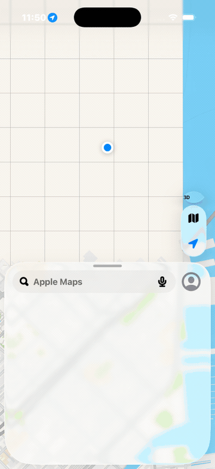

# jev-phone

**A phone agent with a dynamic, indexed action space.**

Give it one goal. [TypeSafe's Jev](https://docs.typesafe.ai/concepts/system-one) picks an operation and a target from what the screen actually offers — in one request, in a few hundred milliseconds, with probabilities instead of prose. [phone-use](https://github.com/Rajmeet/phone-use) executes it on a real iOS Simulator or a cloud iPhone. A small LLM writes text only when the operation is `TYPE`.

**iOS and Android.** Bold Text on in 5.7 s and 4 decisions on an iPhone simulator; a new contact typed and saved in 17.9 s there and 29.7 s on a local Android emulator. Decisions take ~300 ms; the rest is the phone. All verified by reading the phone afterwards (the Android ones through adb), not by trusting the model.



*"Open Settings and go to General, then About" — five decisions, 14.9 s, played at the recorded step timings. It starts two screens deep in Accessibility, left there by the previous run, and backs out first.*

[Design](docs/design.md) · [Measurements](docs/performance.md) · [Read the loop](src/agent.ts)

## The action space

Every observation produces a new element table from the accessibility tree — no screenshots, no OCR:

```text
controls      [1] Cell      General
              [2] Cell      Accessibility
              [3] Button    Search
switches      [1] Switch    Bold Text        value 0
text_fields   [1] SearchField  Search
```

The operations are `TAP`, `TOGGLE`, `TYPE`, `SCROLL_UP`, `SCROLL_DOWN`, `BACK`, `OPEN_APP`, `WAIT`, `DONE` and `BLOCKED`. Only operations the screen supports are offered: no `TOGGLE` without a switch, no `TYPE` without a field, no `OPEN_APP` on the app itself.

```text
                        one Jev request
                       ┌───────────────────────────┐
screen → element table → operation                 │
                       │ tap_target                │
                       │ toggle_target             │
                       │ type_target               │
                       │ app_target                │
                       │ goal_done (independent)   │
                       └─────────────┬─────────────┘
                              use the matching head
                                     │
                      TAP [2] ───────┤──→ phone
                   TOGGLE [1] ───────┘
                     TYPE [1]
                            ↓
                  small LLM → text → phone
```

Target questions are speculative. If the operation is `TAP`, only `tap_target` can execute. Two decisions, **one network round trip**. Each head contains only compatible elements — switches only under `TOGGLE`, fields only under `TYPE` — so Jev cannot type into a button or toggle a row. A `goal_done` question rides in the same request and must agree before a `DONE` is accepted.

There are no app-specific scripts and no prepared field values in the policy. The examples supply a goal and verify the outcome independently.

## Try it

**Requirements:** [Bun](https://bun.sh); a phone — a booted iOS Simulator (macOS + Xcode), an Android emulator or device visible to `adb`, or a phone-use cloud phone (iOS or Android, no Mac needed); and a Jev key. Typing also needs a text-model key — the gateway key covers both.

```bash
git clone https://github.com/Rajmeet/jev-phone.git
cd jev-phone
bun install
cp .env.example .env     # add TYPESAFE_API_KEY or AI_GATEWAY_API_KEY
bun examples/run.ts "Open Settings and go to General, then About"
```

Each decision prints as it happens:

```text
phone: iPhone 17 Pro
 1.   1.7s  BACK  conf 0.92  done 0.01  393ms  → went back — screen changed
 2.   4.6s  BACK  conf 0.41  done 0.01  264ms  → went back — screen changed
 3.   7.4s  TAP "General"  conf 1.00  done 0.02  263ms  → tapped "General" — screen changed
 4.  10.7s  TAP "About"  conf 0.96  done 0.16  263ms  → tapped "About" — screen changed
 5.  14.9s  DONE  conf 0.99  done 0.92  1210ms  [done: independent check 0.92]
```

`bun examples/bold-text.ts` and `bun examples/new-contact.ts` are the verified examples. The first forces Bold Text off, runs the goal, then walks to the switch with plain verbs and reads it. The second confirms a unique name is absent, runs the goal, relaunches Contacts and finds the contact through search. A `DONE` from the model is not proof; the read-back is.

The contact run is also where the done veto earns its keep: with both names typed and the form unsaved, Jev proposes `DONE`; the independent check, reading the same screen, puts P(done) below 0.1; `DONE` is removed from the next request's options and Jev taps `Done`.

```text
 1. TAP "Add"                          conf 0.99  → screen changed
 2. TYPE "First name" ← "Ada"          conf 0.88  +text 339ms
 3. TYPE "Last name" ← "LovelaceCQDL"  conf 0.85  +text 406ms
 4. DONE                               done 0.07  → vetoed
 5. TAP "Done"                         conf 0.96  → screen changed
 6. DONE                               done 0.68  [done]
```

Jev is reachable two ways: TypeSafe's API (`TYPESAFE_API_KEY`) or the [Vercel AI Gateway](https://vercel.com/ai-gateway) (`AI_GATEWAY_API_KEY`, model `typesafe-ai/jev`). The text helper for `TYPE` speaks the OpenAI chat-completions dialect and defaults to the gateway with Llama 4 Scout, reusing the same key; point `TEXT_MODEL_BASE_URL` / `TEXT_MODEL` at anything compatible.

For Android: `--device android` (the adb device/emulator on this machine). For a cloud phone, iOS or Android: `phone-use create ios` / `phone-use create android`, then `eval "$(phone-use env <id>)"` and `--device cloud`. Cloud phones are early: they expire after 15 minutes and heavy screens can wedge the runner; use a local simulator for the demo.

## Use the library

It is not on npm; add it from git (`bun add github:Rajmeet/jev-phone`) or copy `src/`.

```ts
import { connectDevice, run } from 'jev-phone';

const phone = await connectDevice('connect'); // booted simulator; 'launch' | 'android' | 'cloud' | '<udid>'
for await (const step of run(phone.core, 'Turn on Bold Text in Settings')) {
  console.log(step.decision.op, step.decision.element?.label, step.jevMs);
}
await phone.close();
```

`run()` is an async generator: one event per decision, the final result as its return value. `runGoal()` runs to completion. Options: `maxSteps` (25), `doneThreshold` (0.6), `minConfidence` (0 — act on the argmax), `text` (your own helper, or `null` to disable typing), `allowDestructive`, `screenshotDir`.

## Why it moves

- **One request per decision.** Operation and target heads share the same observed state; the done-check rides along.
- **Jev never generates.** Choices come back as label + probability + confidence in ~250–500 ms. The only generation is the text helper, called only for `TYPE`.
- **One observation per step.** The accessibility tree, read once, gives roles, labels, values and frames. Screenshots are optional and the model never sees them.
- **Validate the answer.** Probability keys must equal the offered labels, sum to 1, and the pick must be the argmax. Anything else is a failure, never repaired.
- **Re-find before acting.** The chosen element is re-located on a fresh observation by role, label and value. If it moved, it is pressed where it is now; if it is gone, the agent decides again.
- **Switches at the knob.** An iOS switch's frame spans the row; the centre is the label. `TOGGLE` presses 24 pt from the right edge and reads the value back.
- **Never retry a mutation.** A timed-out press may already have landed.

Every executed target is an observed element. Model output never becomes a selector, a coordinate, a shell command or code. The text helper's output must parse as exactly `{"text": string | null}` before anything is typed.

## Small enough to read

| File | Job |
| --- | --- |
| [agent.ts](src/agent.ts) | The loop, the done veto, the text-helper handoff, execution |
| [policy.ts](src/policy.ts) | The one request: operations, target heads, the done check |
| [screen.ts](src/screen.ts) | Observation → indexed action space; re-finding an element |
| [jev.ts](src/jev.ts) | Plain-fetch Jev client, two transports, strict validation |
| [text.ts](src/text.ts) | The text helper and its contract |
| [apps.ts](src/apps.ts) | What OPEN_APP may target: installed apps plus the built-in Apple ones |
| [device.ts](src/device.ts) | Local simulator or cloud phone; cloud session recovery |

About 1,100 lines of TypeScript including comments, one runtime dependency (`@phone-use/sdk`).

## Evidence and limits

Verified runs across iOS and Android (current code; earlier, slower runs of the same goals are kept in the docs): **Bold Text on in 5.7 s / 4 decisions** from the Settings root, **General → About in 11.8 s / 6 decisions** from two screens deep in another section, and **a contact created in 17.9 s / 6 decisions** with two typed values — all on a local iPhone simulator. On **Android** (a local emulator over adb): Airplane mode on in 15.4 s / 4 decisions (`adb shell settings get global airplane_mode_on` read 0 before and 1 after) and the **same contact goal in 29.7 s / 7 decisions** (OPEN_APP Contacts → Create contact → two TYPEs → Save), the row present in the contacts database afterwards. A cloud Android phone ran both as well (13.0 s and 54.8 s, before the capture reduction). Android costs ~4 s per device step against ~1.5 s on the iOS simulator; the decisions are the same. Jev latency was mostly 250–650 ms per decision, with occasional outliers to 2.5 s. Each step reads the accessibility tree twice (once before acting, once by the verb itself); that read is ~0.7 s on the simulator and ~2 s on Android, and it is the bottleneck, not the model. Full records, and the five discarded attempts with what each one changed, are in [performance.md](docs/performance.md) and [measurement.json](docs/measurement.json).

That is four goals in first-party apps on two platforms. It is not a general phone-agent evaluation. The same policy, run inside phone-use's harness on the [iOSWorld](https://github.com/ljang0/iOSWorld) single-app set on cloud iPhones (2026-09-23, Jev alone, no LLM): of 15 graded tasks, **1 full pass and 52 of 101 rubric points (51%)**, at a median 35 s of agent time per task; 11 further tasks were lost to cloud infrastructure (the runner's accessibility capture timing out on heavy screens) and one timed out. Most iOSWorld tasks also ask the agent to *report* something, and a System One model has no reply channel — those rubric items are always lost. Pair it with an LLM for those; the loop stops with a reason when it cannot proceed.

Known limits: unlabeled icons, custom controls, canvas and in-app web content leave nothing to offer; permission prompts and system alerts are outside the policy; there is no `HOME` (the local simulator backend's home press is a no-op, so `OPEN_APP` switches apps instead); a valid action can still be the wrong one. `DONE` is accepted only with the independent check, and the examples still read the device afterwards.

## Development

```bash
bun run check     # biome + tsc + tests (offline: a scripted Jev and phone-use's FakeBackend)
```

Tests never call paid APIs. Live examples do; their logs are kept under `docs/runs/`.

## Related

- [jev-ultrafast](https://github.com/browser-use/jev-ultrafast) — Browser Use's browser agent with the same operation + target design, which this follows.
- [phone-use](https://github.com/Rajmeet/phone-use) — the device runtime underneath, and the full agent harness (maps, skills, permissions) that the Jev runner there plugs into.
- [TypeSafe: System One models](https://docs.typesafe.ai/concepts/system-one)

MIT.
